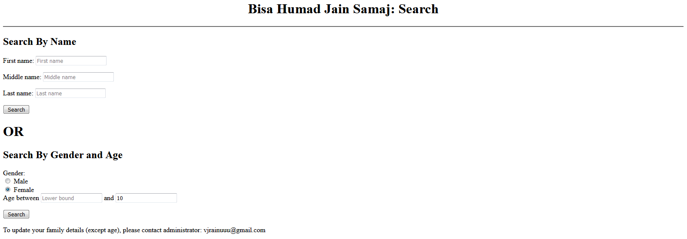
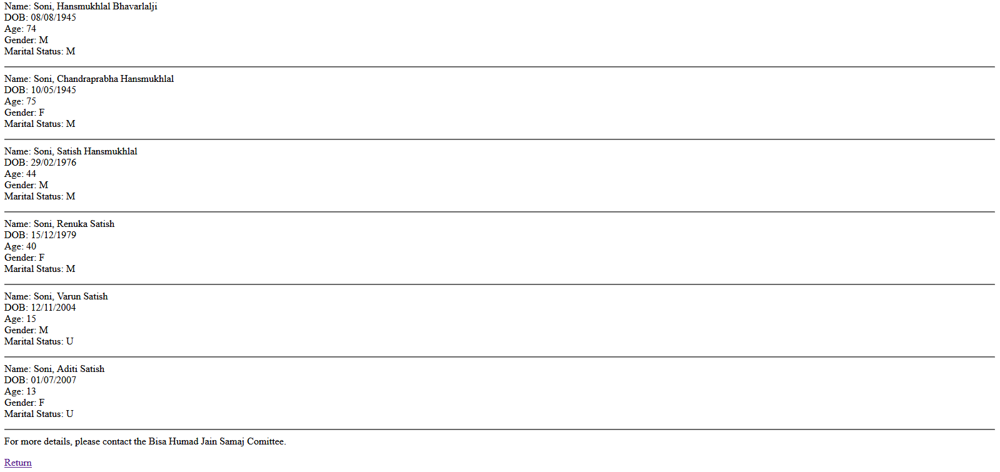

<h1 align="center">Bisa Humad Jain Samaj (Mumbai) Directory Search</h1>

## Description

This is a directory search, implemented using python and html for the CS50x-2020 final project. This enables the Bisa Humad Jain Samaj with a search cum macth finding site.

## How to use
The search can be done by two methods as shown before: Name or Age and Gender.

### Search using Name

Enter either firstname, middlename, or surname, or any two or all of these. It is also possible to enter part of the name i.e. v or va instead of varun. Click "search".

### Search using Age and Gender

Enter either gender, lower bound for age, or upper bound for age, or any two or all of these. Click "search".

### Search result 1

On clicking the search button, a list of names will be presented, like above, but there mst be atleast one name corresponding to your search. Clicking a name will give more information of that person, while "return" goes to the search page.

### Search result 2

This is the result of clicking on a name. "Return" again leads to the search page, while "full family details" gives family details.

### Search result 3

This is a result of clicking "full family details".

## Downsides
1) Database doesn't have all details.
2) 
