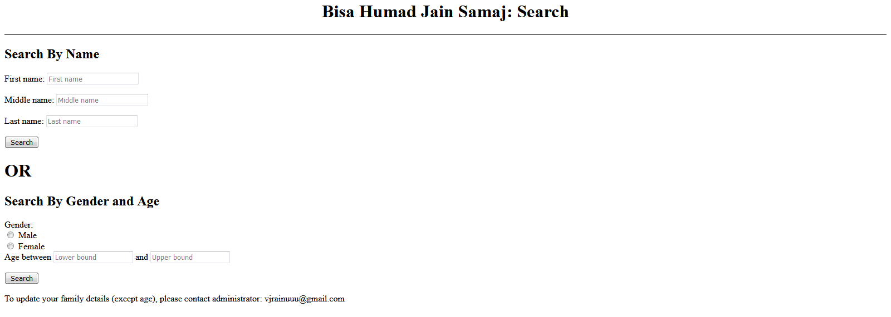
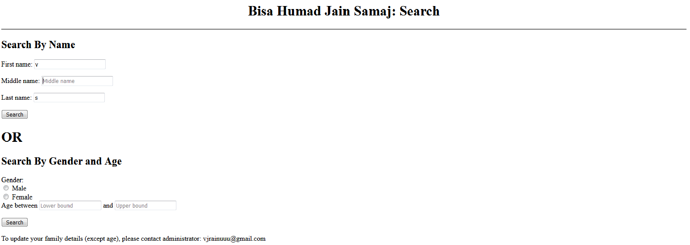

<h1 align="center">Bisa Humad Jain Samaj (Mumbai) Directory Search</h1>

## Description

This is a directory search, implemented using python and html for the CS50x-2020 final project. This enables the Bisa Humad Jain Samaj with a search cum macth finding site.

## How to use
The search can be done by two methods as shown before: Name or Age and Gender.

### Search using Name

Enter either firstname, middlename, or surname, or any two or all of these. It is also possible to enter part of the name i.e. v or va instead of varun. Click "search".

### Search using Age and Gender
